# Data Model Diagram

The PA Compact Data System's schema as of migration `20261007_120000_data_model_status_views`: every table, every column, and every foreign key. It was generated from the database those migrations build, so it shows the schema as it is, not as planned. What each table and column means is in the [data dictionary](data-model.md).

There are two diagrams so the relationships stay legible. Together they show all 112 foreign keys:

1. **The domain model**: 32 tables with their columns, and the 63 relationships between them.
2. **Audit columns**: the 49 relationships from each table's `created_by`, `updated_by`, or `changed_by` to `users` ([ADR-0005](../adrs/0005-data-model-conventions.md)).

Left out: yoyo's migration bookkeeping tables and the local-only `test` table. The three status views, `v_qualifying_license_status`, `v_privilege_status`, and `v_compact_eligibility`, have no foreign keys; they are described under "Computed status" in the dictionary.

**Reading the relationships.** The parent is on the left and the label is the foreign-key column in the child.

| Notation | Meaning |
|---|---|
| `\|\|--o{` | The child must have a parent; a parent has zero or more children (the column is `NOT NULL`) |
| `\|o--o{` | The child may have a parent (the column is nullable) |
| `\|\|--o\|` | One to zero or one: the foreign-key column is unique, e.g. one SSN per practitioner |

Keys: `PK` primary key, `FK` foreign key, `UK` unique.

## Domain model

```mermaid
erDiagram
    adverse_action_npdb_categories {
        bigint adverse_action_id PK,FK
        text npdb_category_code PK,FK
        timestamptz created_at
        bigint created_by FK
        timestamptz updated_at
        bigint updated_by FK
    }
    adverse_actions {
        bigint id PK
        uuid public_id UK
        bigint practitioner_id FK
        char reporting_state_code FK
        text against
        bigint qualifying_license_id FK
        bigint privilege_id FK
        text action_type_code FK
        text summary
        bigint order_document_id FK
        date ordered_on
        date effective_from
        date effective_until
        boolean is_emergency
        boolean is_public
        timestamptz reported_at
        timestamptz created_at
        bigint created_by FK
        timestamptz updated_at
        bigint updated_by FK
    }
    adverse_actions_history {
        bigint id PK
        bigint entity_id FK
        timestamptz changed_at
        bigint changed_by FK
        timestamptz effective_at
        jsonb previous
        jsonb updated
        jsonb removed
    }
    audit_log {
        bigint id PK
        timestamptz occurred_at
        bigint actor_user_id FK
        text action
        text entity_type
        bigint entity_id
        text entity_key
        jsonb before
        jsonb after
        text reason
        text request_id
    }
    compact_settings {
        smallint id PK
        text time_zone
        timestamptz created_at
        bigint created_by FK
        timestamptz updated_at
        bigint updated_by FK
    }
    documents {
        bigint id PK
        uuid public_id UK
        text owner_type
        bigint owner_id
        text owner_key
        text kind
        text storage_key UK
        text file_name
        text content_type
        bigint size_bytes
        text scan_status
        timestamptz created_at
        bigint created_by FK
        timestamptz updated_at
        bigint updated_by FK
    }
    domain_event_deliveries {
        uuid event_id PK,FK
        text handler PK
        integer attempts
        text last_error
        timestamptz handled_at
        timestamptz dead_lettered_at
        timestamptz created_at
    }
    domain_events {
        bigint id PK
        uuid event_id UK
        text type
        text aggregate_type
        bigint aggregate_id
        text aggregate_key
        jsonb payload
        bigint actor_user_id FK
        text request_id
        timestamptz occurred_at
    }
    fees {
        bigint id PK
        uuid public_id UK
        char state_code FK
        text fee_type
        integer amount_cents
        date effective_from
        timestamptz created_at
        bigint created_by FK
        timestamptz updated_at
        bigint updated_by FK
    }
    fees_history {
        bigint id PK
        bigint entity_id FK
        timestamptz changed_at
        bigint changed_by FK
        timestamptz effective_at
        jsonb previous
        jsonb updated
        jsonb removed
    }
    notifications {
        bigint id PK
        uuid public_id UK
        text template
        bigint recipient_user_id FK
        text recipient_email
        jsonb context
        text idempotency_key UK
        text status
        integer attempts
        text last_error
        timestamptz sent_at
        timestamptz created_at
        bigint created_by FK
        timestamptz updated_at
        bigint updated_by FK
    }
    participation_applications {
        bigint id PK
        uuid public_id UK
        bigint practitioner_id FK
        text kind
        char sql_state_code FK
        bigint qualifying_license_id FK
        text claimed_license_number
        date claimed_license_expires_on
        text status
        timestamptz opened_at
        text request_note
        timestamptz license_verified_at
        bigint license_verified_by FK
        date cbc_completed_on
        timestamptz decided_at
        bigint decided_by FK
        text denial_reason_code FK
        text denial_reason_detail
        timestamptz withdrawn_at
        timestamptz eligibility_withdrawn_at
        text eligibility_withdrawal_reason
        timestamptz superseded_at
        timestamptz created_at
        bigint created_by FK
        timestamptz updated_at
        bigint updated_by FK
    }
    participation_applications_history {
        bigint id PK
        bigint entity_id FK
        timestamptz changed_at
        bigint changed_by FK
        timestamptz effective_at
        jsonb previous
        jsonb updated
        jsonb removed
    }
    practitioner_ssn {
        bigint id PK
        bigint practitioner_id FK,UK
        bytea ssn_ciphertext
        smallint ssn_key_version
        bytea ssn_lookup_hash UK
        char ssn_last4
        timestamptz created_at
        bigint created_by FK
        timestamptz updated_at
        bigint updated_by FK
    }
    practitioners {
        bigint id PK
        uuid public_id UK
        bigint user_id FK,UK
        char current_sql_state_code FK
        text legal_first_name
        text legal_middle_name
        text legal_last_name
        text name_suffix
        text sex_code FK
        date date_of_birth
        text residence_line1
        text residence_line2
        text residence_city
        text residence_region
        text residence_postal_code
        text residence_country_code
        text phone
        text correspondence_email
        text pa_program_name
        smallint pa_program_graduation_year
        text nccpa_certification_number
        text nccpa_certification_status
        date nccpa_certification_expires_on
        text npi
        bigint identity_entered_by FK
        char identity_verified_by_state FK
        timestamptz identity_verified_at
        bigint residence_entered_by FK
        char residence_verified_by_state FK
        timestamptz residence_verified_at
        bigint contact_entered_by FK
        char contact_verified_by_state FK
        timestamptz contact_verified_at
        bigint education_entered_by FK
        char education_verified_by_state FK
        timestamptz education_verified_at
        bigint certification_entered_by FK
        char certification_verified_by_state FK
        timestamptz certification_verified_at
        timestamptz created_at
        bigint created_by FK
        timestamptz updated_at
        bigint updated_by FK
    }
    practitioners_history {
        bigint id PK
        bigint entity_id FK
        timestamptz changed_at
        bigint changed_by FK
        timestamptz effective_at
        jsonb previous
        jsonb updated
        jsonb removed
    }
    privilege_number_sequences {
        char state_code PK,FK
        integer last_number
        timestamptz created_at
        bigint created_by FK
        timestamptz updated_at
        bigint updated_by FK
    }
    privilege_requests {
        bigint id PK
        uuid public_id UK
        bigint participation_application_id FK
        bigint practitioner_id FK
        char remote_state_code FK
        bigint qualifying_license_id FK
        text status
        date ql_expires_on_snapshot
        timestamptz submitted_at
        timestamptz decided_at
        bigint decided_by FK
        text denial_reason_code FK
        text denial_reason_detail
        timestamptz withdrawn_at
        timestamptz created_at
        bigint created_by FK
        timestamptz updated_at
        bigint updated_by FK
    }
    privilege_requests_history {
        bigint id PK
        bigint entity_id FK
        timestamptz changed_at
        bigint changed_by FK
        timestamptz effective_at
        jsonb previous
        jsonb updated
        jsonb removed
    }
    privileges {
        bigint id PK
        uuid public_id UK
        bigint privilege_request_id FK,UK
        bigint practitioner_id FK
        char remote_state_code FK
        bigint qualifying_license_id FK
        text privilege_number UK
        text state_privilege_identifier
        timestamptz issued_at
        date expires_on
        text administrator_status
        text deactivation_reason
        timestamptz deactivated_at
        text deactivation_note
        timestamptz created_at
        bigint created_by FK
        timestamptz updated_at
        bigint updated_by FK
    }
    privileges_history {
        bigint id PK
        bigint entity_id FK
        timestamptz changed_at
        bigint changed_by FK
        timestamptz effective_at
        jsonb previous
        jsonb updated
        jsonb removed
    }
    qualifying_licenses {
        bigint id PK
        uuid public_id UK
        bigint practitioner_id FK
        char state_code FK
        text license_number
        text state_reported_status
        date status_effective_on
        date issued_on
        date expires_on
        boolean is_unrestricted
        date terminated_on
        text source
        bigint verified_by FK
        timestamptz verified_at
        timestamptz created_at
        bigint created_by FK
        timestamptz updated_at
        bigint updated_by FK
    }
    qualifying_licenses_history {
        bigint id PK
        bigint entity_id FK
        timestamptz changed_at
        bigint changed_by FK
        timestamptz effective_at
        jsonb previous
        jsonb updated
        jsonb removed
    }
    ref_adverse_action_types {
        text code PK
        text label
        smallint sort_order
        boolean is_active
        timestamptz created_at
        bigint created_by FK
        timestamptz updated_at
        bigint updated_by FK
    }
    ref_denial_reasons {
        text code PK
        text label
        text applies_to
        smallint sort_order
        boolean is_active
        timestamptz created_at
        bigint created_by FK
        timestamptz updated_at
        bigint updated_by FK
    }
    ref_npdb_categories {
        text code PK
        text label
        smallint sort_order
        boolean is_active
        timestamptz created_at
        bigint created_by FK
        timestamptz updated_at
        bigint updated_by FK
    }
    ref_sex {
        text code PK
        text label
        smallint sort_order
        boolean is_active
        timestamptz created_at
        bigint created_by FK
        timestamptz updated_at
        bigint updated_by FK
    }
    sii_reports {
        bigint id PK
        uuid public_id UK
        bigint practitioner_id FK
        char reporting_state_code FK
        bigint qualifying_license_id FK
        bigint privilege_id FK
        text description
        text contact_name
        text contact_email
        text contact_phone
        bigint public_complaint_document_id FK
        date determined_on
        timestamptz reported_at
        timestamptz closed_at
        bigint closed_by FK
        timestamptz created_at
        bigint created_by FK
        timestamptz updated_at
        bigint updated_by FK
    }
    sii_reports_history {
        bigint id PK
        bigint entity_id FK
        timestamptz changed_at
        bigint changed_by FK
        timestamptz effective_at
        jsonb previous
        jsonb updated
        jsonb removed
    }
    states {
        char code PK
        text name UK
        boolean is_member
        date member_effective_on
        boolean is_live
        text practice_requirements_url
        text jurisprudence_requirement
        text supervision_agreement_requirement
        text prescriptive_authority_requirement
        text other_compliance_requirement
        timestamptz created_at
        bigint created_by FK
        timestamptz updated_at
        bigint updated_by FK
    }
    states_history {
        bigint id PK
        char state_code FK
        timestamptz changed_at
        bigint changed_by FK
        timestamptz effective_at
        jsonb previous
        jsonb updated
        jsonb removed
    }
    users {
        bigint id PK
        text email UK
        uuid public_id UK
        text given_name
        text family_name
        text role
        char state_code FK
        boolean is_active
        bigint created_by FK
        timestamptz created_at
        timestamptz updated_at
        bigint updated_by FK
        jsonb permissions
    }

    adverse_actions ||--o{ adverse_action_npdb_categories : "adverse_action_id"
    adverse_actions ||--o{ adverse_actions_history : "entity_id"
    documents |o--o{ adverse_actions : "order_document_id"
    documents |o--o{ sii_reports : "public_complaint_document_id"
    domain_events ||--o{ domain_event_deliveries : "event_id"
    fees ||--o{ fees_history : "entity_id"
    participation_applications ||--o{ participation_applications_history : "entity_id"
    participation_applications ||--o{ privilege_requests : "participation_application_id"
    practitioners ||--o{ adverse_actions : "practitioner_id"
    practitioners ||--o{ participation_applications : "practitioner_id"
    practitioners ||--o| practitioner_ssn : "practitioner_id"
    practitioners ||--o{ practitioners_history : "entity_id"
    practitioners ||--o{ privilege_requests : "practitioner_id"
    practitioners ||--o{ privileges : "practitioner_id"
    practitioners |o--o{ qualifying_licenses : "practitioner_id"
    practitioners ||--o{ sii_reports : "practitioner_id"
    privilege_requests ||--o{ privilege_requests_history : "entity_id"
    privilege_requests ||--o| privileges : "privilege_request_id"
    privileges |o--o{ adverse_actions : "privilege_id"
    privileges ||--o{ privileges_history : "entity_id"
    privileges |o--o{ sii_reports : "privilege_id"
    qualifying_licenses |o--o{ adverse_actions : "qualifying_license_id"
    qualifying_licenses |o--o{ participation_applications : "qualifying_license_id"
    qualifying_licenses ||--o{ privilege_requests : "qualifying_license_id"
    qualifying_licenses ||--o{ privileges : "qualifying_license_id"
    qualifying_licenses ||--o{ qualifying_licenses_history : "entity_id"
    qualifying_licenses |o--o{ sii_reports : "qualifying_license_id"
    ref_adverse_action_types ||--o{ adverse_actions : "action_type_code"
    ref_denial_reasons |o--o{ participation_applications : "denial_reason_code"
    ref_denial_reasons |o--o{ privilege_requests : "denial_reason_code"
    ref_npdb_categories ||--o{ adverse_action_npdb_categories : "npdb_category_code"
    ref_sex |o--o{ practitioners : "sex_code"
    sii_reports ||--o{ sii_reports_history : "entity_id"
    states ||--o{ adverse_actions : "reporting_state_code"
    states |o--o{ fees : "state_code"
    states ||--o{ participation_applications : "sql_state_code"
    states |o--o{ practitioners : "certification_verified_by_state"
    states |o--o{ practitioners : "contact_verified_by_state"
    states |o--o{ practitioners : "current_sql_state_code"
    states |o--o{ practitioners : "education_verified_by_state"
    states |o--o{ practitioners : "identity_verified_by_state"
    states |o--o{ practitioners : "residence_verified_by_state"
    states ||--o| privilege_number_sequences : "state_code"
    states ||--o{ privilege_requests : "remote_state_code"
    states ||--o{ privileges : "remote_state_code"
    states ||--o{ qualifying_licenses : "state_code"
    states ||--o{ sii_reports : "reporting_state_code"
    states ||--o{ states_history : "state_code"
    states |o--o{ users : "state_code"
    users |o--o{ audit_log : "actor_user_id"
    users |o--o{ domain_events : "actor_user_id"
    users |o--o{ notifications : "recipient_user_id"
    users |o--o{ participation_applications : "decided_by"
    users |o--o{ participation_applications : "license_verified_by"
    users |o--o{ practitioners : "certification_entered_by"
    users |o--o{ practitioners : "contact_entered_by"
    users |o--o{ practitioners : "education_entered_by"
    users |o--o{ practitioners : "identity_entered_by"
    users |o--o{ practitioners : "residence_entered_by"
    users ||--o| practitioners : "user_id"
    users |o--o{ privilege_requests : "decided_by"
    users |o--o{ qualifying_licenses : "verified_by"
    users |o--o{ sii_reports : "closed_by"
```

## Audit columns

```mermaid
erDiagram
    users ||--o{ adverse_action_npdb_categories : "created_by"
    users ||--o{ adverse_action_npdb_categories : "updated_by"
    users ||--o{ adverse_actions : "created_by"
    users ||--o{ adverse_actions : "updated_by"
    users ||--o{ adverse_actions_history : "changed_by"
    users ||--o{ compact_settings : "created_by"
    users ||--o{ compact_settings : "updated_by"
    users ||--o{ documents : "created_by"
    users ||--o{ documents : "updated_by"
    users ||--o{ fees : "created_by"
    users ||--o{ fees : "updated_by"
    users ||--o{ fees_history : "changed_by"
    users ||--o{ notifications : "created_by"
    users ||--o{ notifications : "updated_by"
    users ||--o{ participation_applications : "created_by"
    users ||--o{ participation_applications : "updated_by"
    users ||--o{ participation_applications_history : "changed_by"
    users ||--o{ practitioner_ssn : "created_by"
    users ||--o{ practitioner_ssn : "updated_by"
    users ||--o{ practitioners : "created_by"
    users ||--o{ practitioners : "updated_by"
    users ||--o{ practitioners_history : "changed_by"
    users ||--o{ privilege_number_sequences : "created_by"
    users ||--o{ privilege_number_sequences : "updated_by"
    users ||--o{ privilege_requests : "created_by"
    users ||--o{ privilege_requests : "updated_by"
    users ||--o{ privilege_requests_history : "changed_by"
    users ||--o{ privileges : "created_by"
    users ||--o{ privileges : "updated_by"
    users ||--o{ privileges_history : "changed_by"
    users ||--o{ qualifying_licenses : "created_by"
    users ||--o{ qualifying_licenses : "updated_by"
    users ||--o{ qualifying_licenses_history : "changed_by"
    users ||--o{ ref_adverse_action_types : "created_by"
    users ||--o{ ref_adverse_action_types : "updated_by"
    users ||--o{ ref_denial_reasons : "created_by"
    users ||--o{ ref_denial_reasons : "updated_by"
    users ||--o{ ref_npdb_categories : "created_by"
    users ||--o{ ref_npdb_categories : "updated_by"
    users ||--o{ ref_sex : "created_by"
    users ||--o{ ref_sex : "updated_by"
    users ||--o{ sii_reports : "created_by"
    users ||--o{ sii_reports : "updated_by"
    users ||--o{ sii_reports_history : "changed_by"
    users ||--o{ states : "created_by"
    users ||--o{ states : "updated_by"
    users ||--o{ states_history : "changed_by"
    users ||--o{ users : "created_by"
    users ||--o{ users : "updated_by"
```

## Keeping it current

A PR that adds or changes a migration updates this file in the same PR (constitution Principle XI).
