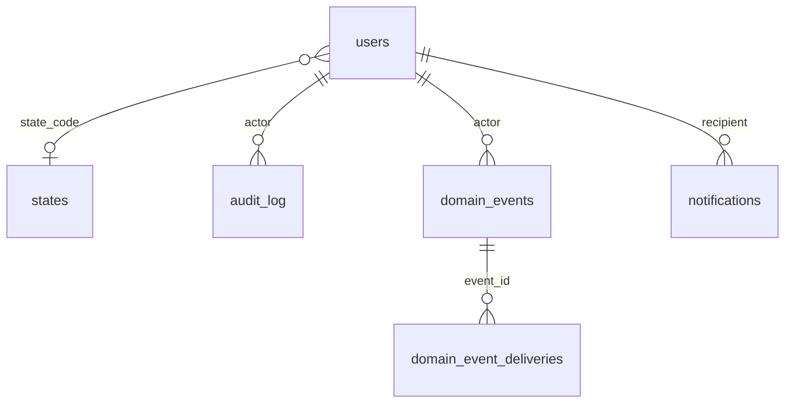

# Data Model

The PA Compact Data System's relational data model: every table, what each column means, the rule that requires it, who may see it, and which epic owns it. Owners amend their tables with forward-only migrations without approval; a change to a shared root needs the tech lead (`product/backlog/mvp-jira-tickets.md`, "How an engineering ticket is owned").

- Conventions: [ADR-0005](../adrs/0005-data-model-conventions.md)
- Dates and the reference time zone: [ADR-0006](../adrs/0006-reference-time-zone-and-dates.md)
- SSN storage: [ADR-0007](../adrs/0007-ssn-storage.md)
- Expungement and append-only history: [ADR-0008](../adrs/0008-expungement-and-append-only-history.md)
- Plan: [F-02 base data model](../thoughts/shared/plans/api/2026-10-07-F-02-canonical-data-model.md)

Rule citations are to the adopted Rules 3 and 4 in `product/context/research-corpus/sources/` and to the model legislation (ML).

## Confidentiality tiers

| Tier | Who may see it |
|---|---|
| Public | Anyone, through public verification (Rule 4 §4.5(b)) |
| Private | The PA themselves, and state and Commission users with a relationship to the PA (`read_private`) |
| States and Commission | State and Commission users only; never the PA or the public (ML §8.C) |
| Restricted | The full SSN: `read_ssn`, every read audited (ADR-0007) |
| Internal | System bookkeeping, not shown to users |

Every table also has the audit columns `created_at`, `created_by`, `updated_at`, `updated_by` (ADR-0005), not repeated below.

## Diagram

The diagram grows with each phase of the F-02 plan.

## Shared roots

These belong to the platform (epic 2). Changing one needs the tech lead.

### `users`

A person who can sign in, or the system user that workers and jobs write as. Tier: internal, except `email` and names, which are private.

| Column | Type | Meaning |
|---|---|---|
| `id` | BIGSERIAL | Internal key |
| `email` | TEXT, unique | Sign-in address |
| `public_id` | UUID, unique, NULL | The Cognito `sub`; NULL until first sign-in (ADR-0003) |
| `given_name`, `family_name` | TEXT | From Cognito |
| `role` | TEXT, CHECK | `licensee`, `state_staff`, `state_admin`, `compact_admin`, `admin` (backlog D5) |
| `state_code` | CHAR(2), FK `states`, NULL | The staff member's state; NULL for `admin` and `compact_admin` |
| `is_active` | BOOLEAN | An inactive user cannot sign in |
| `permissions` | JSONB object | Per-state permissions, e.g. `{"KS": ["write", "read_private"]}` (D5) |

The system user is `system@pa-compact.invalid`: inactive, no `public_id`, its own creator.

### `compact_settings`

One row (`id = 1`) of compact-wide configuration. Tier: internal.

| Column | Type | Meaning |
|---|---|---|
| `time_zone` | TEXT | The reference time zone for every date (ADR-0006); default `America/New_York` |

Later epics add the Commission fee and similar settings here.

### `states`

Every US jurisdiction: the 50 states, DC, and five territories. Membership and go-live are configuration (Q-03). Tier: public. Owner: platform; epic 7 (S-01) edits the configuration columns.

| Column | Type | Meaning |
|---|---|---|
| `code` | CHAR(2), PK | USPS code |
| `name` | TEXT, unique | |
| `is_member` | BOOLEAN | A participating state |
| `member_effective_on` | DATE, NULL | When membership took effect |
| `is_live` | BOOLEAN | Accepting applications; only a member can be live |
| `practice_requirements_url` | TEXT, NULL | Shown to PAs choosing states (S-01) |
| `jurisprudence_requirement`, `supervision_agreement_requirement`, `prescriptive_authority_requirement`, `other_compliance_requirement` | TEXT, CHECK | `none`, `attestation`, or `proof_upload`: what the state requires before issuing (Rule 3 §3.4(c)(3)–(6)) |

### Lookup tables

Lists that wait on a Commission answer, so an answer is a data change. Each has `code` (PK), `label`, `sort_order`, and `is_active`; inactive values stay so old rows keep their meaning. Tier: public.

| Table | Values | Owner |
|---|---|---|
| `ref_sex` | Empty until Q-10 is answered | Epic 5 |
| `ref_adverse_action_types` | The examples in ML §2.A: license denial, censure, revocation, suspension, probation, monitoring, practice restriction, other | Epic 9 |
| `ref_npdb_categories` | Empty until Q-17 is answered | Epic 9 |
| `ref_denial_reasons` | Eligibility reasons from ML §4.A(1)–(8) and privilege reasons from Rule 3 §3.4(c)–(d); `applies_to` is `eligibility` or `privilege` (Q-08 default) | Epics 7 and 8 |

The `conviction` denial reason names a category, not a record; whether naming it is allowed under ML §8.B.4 is part of Q-08.

### `audit_log`

One action a person or the system took, including staff reads of private data. Append-only (ADR-0008). Tier: internal; readable by `compact_admin` and `admin`.

| Column | Type | Meaning |
|---|---|---|
| `occurred_at` | TIMESTAMPTZ | |
| `actor_user_id` | BIGINT, FK `users`, NULL | NULL only for actions with no user |
| `action` | TEXT | e.g. `ssn.revealed` |
| `entity_type`, `entity_id` | TEXT, BIGINT | What the action touched |
| `before`, `after` | JSONB, NULL | Changed values; never an SSN or an expunged value |
| `reason` | TEXT, NULL | Why, where the action requires one (an SSN reveal) |
| `request_id` | TEXT, NULL | Correlates with logs |

### `domain_events` and `domain_event_deliveries`

The transactional outbox (backlog D2): an event is written in the same transaction as the change it describes, and the worker delivers it to handlers. F-05 adds the code. Tier: internal.

`domain_events`: `event_id` (UUID, unique), `type` (listed in [FLOW-07](../../product/context/flows/07-domain-event-catalogue.md)), `aggregate_type` and `aggregate_id`, `payload` (JSONB, **IDs only, never PII**), `actor_user_id`, `request_id`, `occurred_at`.

`domain_event_deliveries`: one row per `(event_id, handler)`, with `attempts`, `last_error`, `handled_at`, and `dead_lettered_at`. Handlers are idempotent on this key.

### `notifications`

An email the worker sends (backlog D7); F-11 adds the code. Tier: private.

| Column | Type | Meaning |
|---|---|---|
| `public_id` | UUID | |
| `template` | TEXT | Template name |
| `recipient_user_id`, `recipient_email` | FK `users` NULL, TEXT | The address is copied at write time (Rule 3 §3.5(b): "the e-mail address currently on-file") |
| `context` | JSONB | Template values |
| `idempotency_key` | TEXT, unique | A repeated request sends once |
| `status` | TEXT, CHECK | `pending`, `sent`, `failed`; `sent_at` is set exactly when `sent` |

## Core entities

Added by F-02 phase 2: practitioners and SSNs, documents, qualifying licenses, participation applications, privilege requests, privileges, adverse actions, and SII reports, each with a history table.

## Status functions

Added by F-02 phase 3: license status, privilege status, and compact eligibility, as of any date.

## Reserved for later epics

Named here so the owning epic creates them with the conventions above. Not created yet.

| Table or columns | Owner |
|---|---|
| `fees`, `transactions`, `transaction_line_items`, privilege-request proof rows | Epic 8, privilege and payment |
| `licensure_denials` (Rule 4 §4.3(c)(14)), state administrator contacts, state fees | Epic 7, license records and SQL review |
| `ingestion_batches`, `qualifying_licenses.ingestion_batch_id` | Epic 13, state data ingestion |
| `renewal_checks`, `privileges.renewed_at` | Epic 9, status and renewal |
| `attestations` catalogue and accepted attestations | Epic 6, participation |
| `practitioner_other_names` (Rule 4 §4.3(c)(2)), address and email change log (Rule 4 §4.3(e)(1)–(2)) | Epic 5, accounts and profile |
| NCCPA lookup source and `fetched_at` | Epic 14, NCCPA |
| Adverse actions a PA reports from a non-participating state (ML §4.A(12)) | Epic 9 |
| `case_messages` | Deferred (backlog §5.1) |
