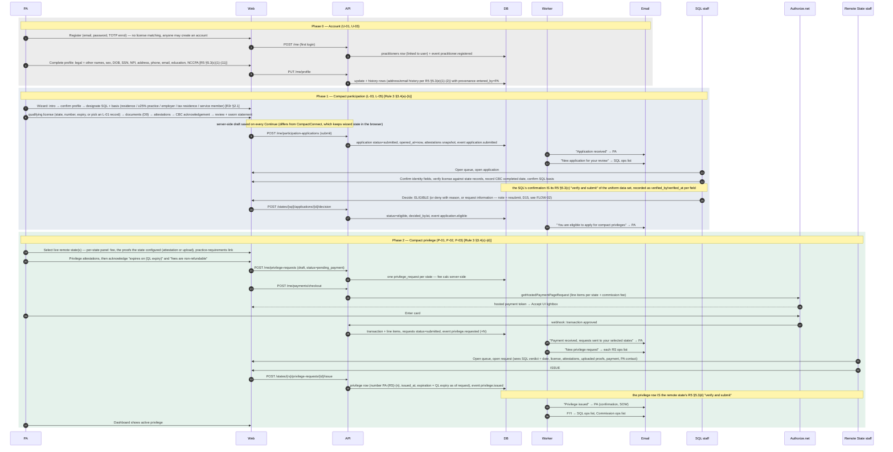

> **Needs review (2026-10-01, SCRUM-39).** This file cites two atoms that quoted draft rule text. That text changed when Rules 3 and 4 were adopted on 2026-04-06. `ATOM-GOV-R23-05` is replaced by `ATOM-GOV-R3-01`; `ATOM-GOV-R5-02` is replaced by `ATOM-GOV-R4-01`. The draft and adopted text are side by side in `product/context/evidence/CHANGES-2026-10-01-adopted-rules.md`. Remove this note when the file is updated.

# FLOW-01 — End-to-end compact privilege issuance

From "I want to practise in another state" to "privilege issued". Three phases; the Commission's role in the happy path is played by the system itself (R3r §3.2(a): provide the application, facilitate SQL review, collect and remit fees). Commission staff watch the dashboard (C-01) and pull reports (C-02).

The record that moves through the three phases is the **uniform data set**: one Commission-held record per PA that several parties write to, each verifying its own lane (R5 §5.3(c)–(e); `SIGNAL-the-uniform-data-set-is-one-record-with-per-field-provenance`). The PA enters it in Phase 0, the SQL verifies its lane in Phase 1, and each remote state writes its privilege lane in Phase 2. Every field carries who entered it, who verified it, and when.

## Why two phases

The PA compact is mutual recognition, not a multistate license. Only the state that issued the license (the SQL) can vouch that it is unrestricted and that the PA meets ML §4.A; remote states rely on that verdict rather than re-verifying. Detail in FLOW-02. Phase 2 detail, including payment, in FLOW-03.

## Where this differs from CompactConnect

CompactConnect is the reference for the shape of every screen in this flow (crosswalk §3, captures in `product/context/reference/compactconnect-screens/`). Four differences come from the PA rules and are the reason Phase 1 exists at all (crosswalk §2):

| | CompactConnect | Here |
|---|---|---|
| Who decides eligibility | the home state's upload flag | the SQL reviews in-system (R3r §3.4(b)) |
| Who issues | payment is issuance | the remote state, from a queue (R3r §3.4(d)) |
| How the PA gets an account | must match an uploaded license | self-signup; identity is established by the SQL's review |
| Whose data it is | the state's; the PA attests it is correct | the PA's, SQL-verified, with history (R5 §5.3) |

Everything else in the diagram follows CompactConnect: card checkout through the Authorize.net lightbox with fees itemised per state, versioned attestations accepted by checkbox, a privilege that expires with the license, email as the only channel, two-factor login for everyone.

## Invariants this flow must hold

| Rule | Invariant |
|---|---|
| ML §4.B, R3r §3.5(a) | Privilege expiration = QL expiration as of the request; QL renewal does not extend it |
| R3r §3.4(d) | Remote state issues only after fees received, requirements met, and SQL eligibility verified |
| R5 §5.3(c)-(d) | One PA record; each field records who entered it and which state verified it and when. The SQL's confirmation is its submission of the §5.3(c) fields; the privilege row is the remote state's submission of the §5.3(d) fields |
| R5 §5.3(e) | Every address and email change, every attestation, every application, and every state-submitted verification document is retained on the record |
| R5 §5.2(g) | No criminal background check result is ever stored |

## Evidence

Atoms are in `product/context/evidence/atoms/`; signals and tensions beside them. Rule section references above resolve to these IDs.

- `ATOM-GOV-ML-01`, `ATOM-GOV-ML-02` — definitions of Qualifying License and Compact Privilege
- `ATOM-GOV-R23-03` — the Commission provides the application, facilitates SQL review, collects and remits fees
- `ATOM-GOV-R23-05` — Phase 1: online application with sworn statement, SQL designation, CBC, fees
- `ATOM-GOV-R23-07`, `ATOM-GOV-R23-08` — Phase 2: application to remote states; issuance on fees + info + SQL verification
- `ATOM-GOV-R5-02` — the 15 fields the SQL verifies and submits (Phase 0 profile fields, Phase 1 verification)
- `ATOM-GOV-R5-03` — the privilege fields the remote state verifies and submits (Phase 2 issuance)
- `ATOM-GOV-R5-04` — address and email history, applications, attestations, and state documents are part of the record
- `ATOM-GOV-RFP-01` — the PA priority story this flow satisfies end to end
- `SIGNAL-the-sql-is-the-sole-eligibility-authority` — why there are two phases
- `SIGNAL-the-system-does-the-heavy-lifting-for-states` — why the Commission has no manual step in the happy path
- `SIGNAL-the-uniform-data-set-is-one-record-with-per-field-provenance` — why there is one record with three writers rather than a state upload
