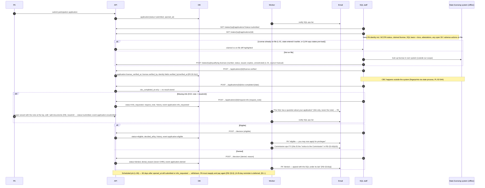

> **Needs review (2026-10-01, SCRUM-39).** This file cites five atoms that quoted draft rule text. That text changed when Rules 3 and 4 were adopted on 2026-04-06. `ATOM-GOV-R23-05` is replaced by `ATOM-GOV-R3-01`; `ATOM-GOV-R23-06` is replaced by `ATOM-GOV-R3-02`; `ATOM-GOV-R23-13` is replaced by `ATOM-GOV-R3-04`; `ATOM-GOV-R23-14` is replaced by `ATOM-GOV-R3-05`; `ATOM-GOV-R5-02` is replaced by `ATOM-GOV-R4-01`. The draft and adopted text are side by side in `product/context/evidence/CHANGES-2026-10-01-adopted-rules.md`.  Added 2026-10-02 (SCRUM-39): `ATOM-GOV-M0825-01` is replaced by `ATOM-GOV-M0825-03`, which quotes the full exchange from the same minutes. In it, counsel N. Kalfas says "I do not see how the commission will generate some of this information." The adopted Rule 4.3(c)(14) has the state of qualifying license verify and submit "Any denial of licensure, and the reason(s)". Line 113 of this flow says denials are "Never entered by a state". Added 2026-10-02 (SCRUM-39): `ATOM-GOV-M0825-02` is replaced by `ATOM-GOV-M0825-04`, which adds counsel N. Kalfas's next turn: "allow the state to put in what they have". The adopted rules keep both routes: the state verifies and submits the "Primary residence address of record" (Rule 4.3(c)(6)), and PA changes are kept as history (Rule 4.3(e)(1)). Remove this note when the file is updated.

# FLOW-02 — SQL eligibility verification

The step with no CompactConnect equivalent (crosswalk §4.4: the nearest thing a CompactConnect state does is tick "compact eligible" on a bulk upload). Rule 3 §3.4(b) assigns the State of Qualifying License four duties, all recorded "through the data system":

1. evaluate eligibility (ML §4.A criteria)
2. run a criminal background check (CBC) within 60 days — **results never enter the system** (R5 §5.2(g))
3. confirm the PA meets one SQL basis in Rule 2 (residence, active practice, employer, tax residence, service member)
4. issue notice to the Commission verifying or denying eligibility

Doing these four things in the case view is also how the SQL "verifies and submits" its lane of the uniform data set (R5 §5.3(c)). There is no separate state upload: the PA entered the identity, education, and certification fields in Phase 0; the SQL's confirmation on this screen records `verified_by` and `verified_at` on each, and the license fields the SQL enters or links are state-authored from the start (`SIGNAL-the-uniform-data-set-is-one-record-with-per-field-provenance`).

## Guardrails the tickets enforce

- Only users with `write` on the SQL state can act; other states see nothing about this application (R5 §5.6(a)).
- `decision` requires `license_verified_at` and `cbc_completed_at`.
- The verdict is immutable; the only later transition is **withdraw eligibility** (FLOW-05).
- The PA's "under investigation" attestation is about the SQL only (Feb 9 2026 minutes) and is cross-checked against open SII the SQL has on file.
- Denial reasons exclude criminal history record information (ML §8.B.4).
- Documents the SQL attaches while verifying are retained as part of the record (R5 §5.3(e)(4), D9).

## SQL ↔ PA communication (decision D15)

**MVP: note + resubmit.** "Request information" stores a `request_note` on the application, flips it to `info_requested`, and emails the PA a link (never the note body). The PA reopens the wizard (L-03) with the note at the top, edits the application, adds documents where the note asks for proof, and resubmits; the application returns to `submitted` and the note and resubmission stay in history. The PA's dashboard timeline (L-04) shows "information requested" with the note. No message thread and no new tables. Remote states have no in-app request at pilot; they use the PA's contact details from the case view (FLOW-03).

**Deferred (§5.1):** a case message thread (`case_messages`, `case_message.posted`) reused on both case views, with attachments. Usability round 2 (Sprint 5) is the gate: it comes back if SQL staff or PAs cannot work the note + resubmit loop, or a remote state cannot issue without asking the PA something in-system.

## Uniform data set: what the SQL owns after verification

| Field group | Entered by | Verified by | After verification |
|---|---|---|---|
| Identity: names, sex, DOB, SSN, NPI, address, phone, email, education, NCCPA | PA (U-03) | SQL, on this screen | PA edits stay PA-owned; history records them and they propagate to every state with a relationship to the PA (`ATOM-GOV-M0825-02`, U-03). The SQL follows up if concerned. A re-verification flag is deferred (§5.1) |
| License: number, status, issue and expiration dates | SQL (L-01) | — (state-authored) | Only the state updates it (A-01) |
| Adverse actions, SII, licensure denials | SQL (A-02) | — | Only the state |
| Denials, compact-level ineligibility periods | Commission (computed) | — | Never entered by a state (`ATOM-GOV-M0825-01`) |

Residual question for Commission counsel (folded into Q-04): confirm that an in-system verification by SQL staff satisfies "verify and submit" under R5 §5.3(c) and ML §8.B, so no separate state-side data feed is expected at pilot.

## What the SQL staff screen needs (for the wireframe)

A queue with age and a 60-day countdown; a case view with four checklist items (basis, license, CBC, attestations), the request-note control, and one decision control; an audit trail. Borrow CompactConnect's list chrome for the queue (the "Viewing: {filters} ×" chip and "Edit search"; `staff-search-results.png`) and its practitioner-detail layout for the case view (alert banner, breadcrumb, name, state tags, collapsible sections; `staff-practitioner-detail.png`), then add the checklist and controls (crosswalk §4.4). The license entry form (L-01) renders as CompactConnect's `LicenseCard` once saved (crosswalk §4.3). Usability round 2 (Sprint 5) tests this screen specifically.

## Evidence

Atoms are in `product/context/evidence/atoms/`; signals and tensions beside them. Rule section references above resolve to these IDs.

- `ATOM-GOV-R23-06` — the four SQL duties, ending in a notice "through the data system"
- `ATOM-GOV-R23-01` — the SQL designation bases the SQL confirms
- `ATOM-GOV-R23-05` — what the PA submits (sworn statement, CBC via the SQL process, fees)
- `ATOM-GOV-ML-05`, `ATOM-GOV-ML-06` — NCCPA certification and no-conviction eligibility criteria
- `ATOM-GOV-R5-01` — CBC results never enter the system
- `ATOM-GOV-R5-02` — the 15 fields the SQL "verifies and submits"; this screen is where that happens
- `ATOM-GOV-ML-14` — denial reasons exclude criminal history record information
- `ATOM-GOV-R23-13` — 60-day abandonment
- `ATOM-GOV-R23-14` — denial appeal lies with the SQL (confirm the 30-day window before using it in copy)
- `ATOM-GOV-R5-04` — attestations, documents, and PA-provided changes are part of the retained record
- `ATOM-GOV-R5-08` — state access scoped to PAs with a QL or privilege in that state
- `ATOM-GOV-M0825-01` — state-submitted data versus Commission-maintained data (denials, ineligibility periods)
- `ATOM-GOV-M0825-02` — the PA updates the address in the system, it propagates to states, the SQL follows up if concerned
- `ATOM-GOV-RFP-02` — the state-admin priority story
- `SIGNAL-the-sql-is-the-sole-eligibility-authority`
- `SIGNAL-the-uniform-data-set-is-one-record-with-per-field-provenance`
