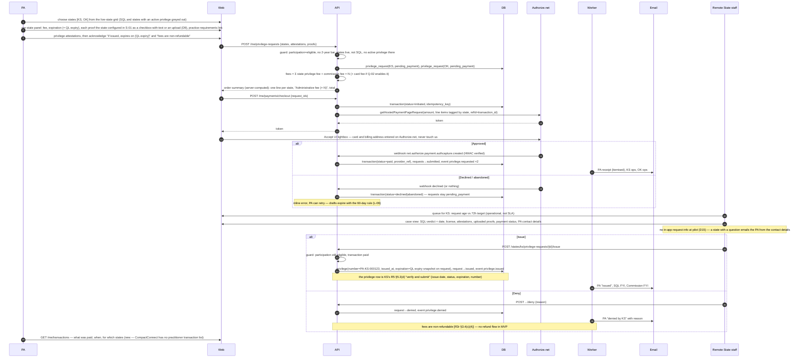

> **Needs review (2026-10-01, SCRUM-39).** This file cites one atom that quoted draft rule text. That text changed when Rules 3 and 4 were adopted on 2026-04-06. `ATOM-GOV-R23-13` is replaced by `ATOM-GOV-R3-04`. The draft and adopted text are side by side in `product/context/evidence/CHANGES-2026-10-01-adopted-rules.md`. Remove this note when the file is updated.

# FLOW-03 — Payment and remote-state issuance

Phase 2 of FLOW-01 in detail. The PA applies to one or more remote states, pays state fee(s) plus the Commission fee, and each remote state issues or denies. The 72-hour issuance target is operational (RFP Q&A #46.1), not a system SLA; it is measured from the paid request reaching the remote state.

The PA-side steps are CompactConnect's purchase wizard step for step (crosswalk §3.6; captures `pa-privilege-step2-*.png` through `pa-privilege-step4-payment-summary.png`). Only the ending changes: CompactConnect says "purchased" and the privilege exists the moment payment clears; we say "sent to {states} for issuance" and the remote state issues from a queue (R3r §3.4(d)). The state-side queue and case view have no CompactConnect equivalent (crosswalk §4.5).

## Per-state proofs (S-01, Q-07)

CompactConnect's per-state panel has one configurable proof: "jurisprudence exam required?" with a link, accepted as a checkbox that opens the full text. Ours generalises it to the four things R3r §3.4(c)(3)–(6) let a remote state require: jurisprudence, supervision/collaborative agreement, prescriptive authority, other compliance. Each is configured per state as `none | attestation | proof_upload`; an attestation renders as CompactConnect's checkbox-with-modal (`pa-privilege-step2-attestation-modal.png`), an upload as the F-12 file field. "More info" is the state's practice-requirements URL. Which proofs each pilot state requires is Q-07.

## Payment integration shape (Q-02b)

Authorize.net is not hosted-only. The Accept suite offers three shapes; the trade is PCI scope against control of the payment form's accessibility:

| Shape | Where the card form lives | PCI scope | WCAG control |
|---|---|---|---|
| Accept Hosted | Authorize.net page (redirect or iframe) | SAQ A | none |
| Accept.js + built-in form (Accept UI lightbox) | Authorize.net lightbox on our page | SAQ A | none |
| Accept.js + our own form | our USWDS form; only an opaque nonce reaches the API | SAQ A-EP | full |

**MVP: Accept UI lightbox** (D6, CompactConnect parity), accessibility limitation documented as a known exception in H-01. The `PaymentProvider` protocol allows a later move to our own form (deferred, §5.1: pulled back if H-01 cannot document the lightbox as an acceptable exception).

## Deferred (§5.1): ACH and settlement

Card only at pilot. eCheck.Net is reachable through the same Accept.js path (`bankData`), but there is no settlement or returned-item webhook: an eCheck sits in `capturedPendingSettlement` for several business days, then `settledSuccessfully` or `returnedItem`, discoverable only by polling `getTransactionDetails`. That is incompatible with the 72-hour target unless remote states issue at risk. If the Commission requires bank payment (Q-02c), the request gains a `submitted_payment_pending` status, issuance is gated on settlement, and a `reconcile_transactions` job polls settlement state and emits `payment.settled` / `payment.returned`. The settlement job also returns on its own if the Commission asks for settlement status in C-02.

## Local development

`PAYMENT_PROVIDER=fake` renders a stub card page that approves or declines by the amount's cents (`.00` approve, `.99` decline) and posts the same webhook payload shape. (`.50` pending-settlement arrives with ACH.)

## Evidence

Atoms are in `product/context/evidence/atoms/`; signals and tensions beside them. Rule section references above resolve to these IDs.

- `ATOM-GOV-R23-07` — remote-state application; non-refundable state fee plus Commission administrative fee
- `ATOM-GOV-R23-08` — issuance on receipt of fees, information, and SQL verification; privilege data goes to the data system
- `ATOM-GOV-R23-03` — the Commission collects and remits fees (why line items are tagged by state)
- `ATOM-GOV-ML-07` — the 2-year bar guard on the request
- `ATOM-GOV-R23-13` — 60-day abandonment of an unpaid request
- `ATOM-GOV-R5-03` — what the remote state "verifies and submits" on issuance (issue date, status, expiration, privilege number); the privilege row is that submission
- `ATOM-GOV-RFP-05` — the 72-hour story (operational target, not an SLA)
- `ATOM-GOV-RFPQA-03` — the Commission selects the payment processor
- `SIGNAL-the-system-does-the-heavy-lifting-for-states`
- `SIGNAL-the-uniform-data-set-is-one-record-with-per-field-provenance` — the remote state's lane of the record
