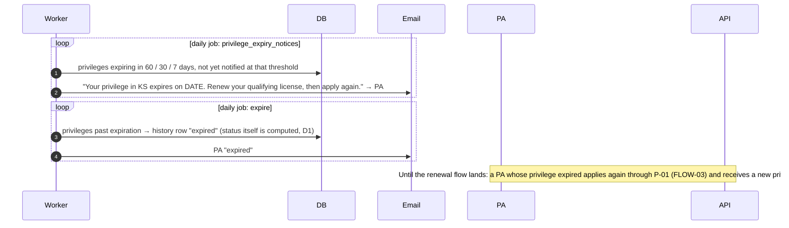
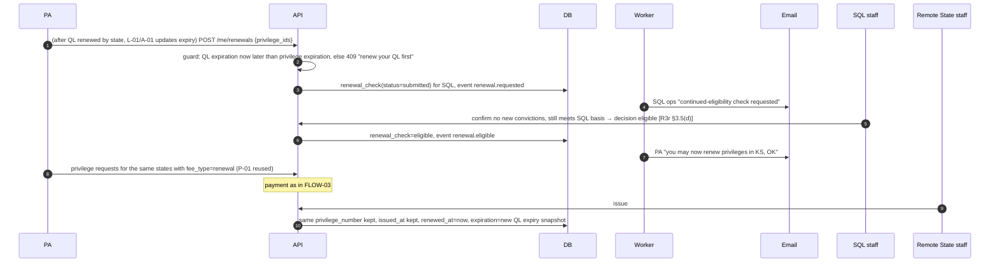

> **Needs review (2026-10-01, SCRUM-39).** This file cites one atom that quoted draft rule text. That text changed when Rules 3 and 4 were adopted on 2026-04-06. `ATOM-GOV-R23-12` is replaced by `ATOM-GOV-R3-03`. The draft and adopted text are side by side in `product/context/evidence/CHANGES-2026-10-01-adopted-rules.md`. Remove this note when the file is updated.

# FLOW-04 — Privilege expiration and renewal

Key rule: a privilege's expiration is **pinned** to the QL expiration as it was when the privilege was requested. Renewing the QL does not extend the privilege (R3r §3.5(a)). CompactConnect applies the same rule and shows it on the dashboard as a clock icon whose tooltip says privileges expire when the license does (`pa-dashboard-expiry-explanation.png`); we keep that device. Renewal = the SQL confirms continued eligibility (R3r §3.5(d)) → the PA re-applies to remote states, with fee (R3r §3.5(e)). The Nov 10 2025 minutes ask that the system, not the state, track which PAs use each SQL: "the system should be doing the heavy lifting there."

## What the pilot builds (A-04)

Expiry notices and expiry only. The renewal flow is deferred (§5.1) because no privilege issued in the pilot can reach its QL expiry inside the period of performance; H-04 computes the earliest such date at go-live, and the flow is pulled back in if any pilot privilege comes within 90 days of it or the Commission wants it demonstrated.

## Invariants

- The 60-day notice is the rule minimum (R3r §3.5(b)); 30 and 7 are the Q-14 defaults. CompactConnect sends 30 / 7 / 0 (crosswalk §8); our 0-day message is the "expired" notice from the `expire` job, not a fourth reminder. Each threshold fires once per privilege (idempotency key).
- Grace (R3r §3.5(c)): if the QL stays "active" past its expiration date because the SQL has not updated it, privileges stay active until the SQL updates the QL (A-01).
- Expiration is computed status (decision D1); the daily `expire` job only writes history and sends notice.
- On the privilege detail page, under 90 days from expiry the history timeline shows a caution icon and "Expiring in N days", as CompactConnect's does (`pa-privilege-detail.png`, crosswalk §3.4).

## Deferred (§5.1): the renewal flow

Recorded here so the pilot build does not paint it out. Shape: L-05 reused with a renewal badge; P-01 reused with `fee_type=renewal`; P-03 keeps the number.

- A renewed privilege keeps its number and `issued_at`; `renewed_at` and the pinned `expiration_date` change.
- Jurisprudence (R3r §3.7): a PA renewing in the same remote state before expiry may submit proof the requirement is already met; after expiry the full requirement applies again.

## Evidence

Atoms are in `product/context/evidence/atoms/`; signals and tensions beside them. Rule section references above resolve to these IDs.

- `ATOM-GOV-R23-09` — expiration pinned to the QL expiry on the application date; QL renewal does not renew the privilege
- `ATOM-GOV-ML-09`, `ATOM-GOV-ML-12` — statute: privilege valid until, and expires when, the QL expires
- `ATOM-GOV-R23-10` — 60-day e-mail notice from the Commission
- `ATOM-GOV-R23-11` — grace while the SQL has not updated an expired-but-active QL
- `ATOM-GOV-R23-12` — SQL continued-eligibility check at renewal (deferred flow)
- `ATOM-GOV-M1110-02` — the system, not the state, tracks who uses each SQL
- `ATOM-GOV-RFP-03` — the PA priority story on expiration notice
- `SIGNAL-privilege-life-is-tied-to-the-qualifying-license`
