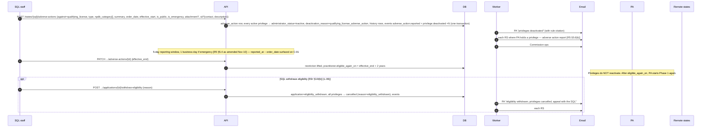

# FLOW-05 — Adverse action on the qualifying license

ML §4.B / §6.G: an adverse action on the QL deactivates **every** privilege. There is no automatic reinstatement; the PA may apply again two years after the restriction ends (ML §4.A.8, §4.C). An adverse action against a **single privilege**, reported by that remote state (ML §6.B.1), affects only that privilege.

## Report content and confidentiality

- Per the Nov 10 2025 amendments to R5 §5.4: a **structured record** (summary plus NPDB category), not document copies; a state that wants the order on file may attach it (optional, D9). SII is a checkbox plus contact information and a brief description on the same form; 5-day window, 1 business day for summary/emergency actions.
- `is_public=false` records never reach public verification (V-01) and show a "confidential — do not redisclose" banner to state users (R5 §5.5(c)).
- SII is visible only to participating-state and commission users, never to the PA or the public (ML §8.C).
- Notification goes to the PA, every state where the PA holds a QL or privilege, and the Commission (R5 §5.6(b)); other states may request the report (R5 §5.6(c)).

## CompactConnect reference (crosswalk §4.7)

The dialogs follow CompactConnect's card action menu (`staff-privilege-action-menu.png`) and differ only in what we add and in what the cascade does:

| Action | CompactConnect | Here |
|---|---|---|
| Deactivate a privilege | compact admin only; required note; confirm; PA and state emailed (`staff-deactivate-privilege-modal.png`) | issuing state or Commission; same dialog |
| Report discipline ("encumber") | action type + NPDB category (multi) + start date; on a license it *marks* every privilege encumbered (`staff-encumber-privilege-modal.png`) | same two pick-lists, plus summary, order date, emergency and public flags, optional attachment, SII checkbox with contact; on a QL it **deactivates** every privilege (ML §4.B / §6.G) |
| Lift | pick the action(s), give an end date; the privilege stays encumbered while any action is unlifted; on lift, restored (`staff-lift-encumbrance-modal.png`) | same dialog; a QL-level lift does **not** reactivate, the PA may reapply two years after the end date; a privilege-level lift restores that privilege when all actions on it are lifted |
| Investigation / SII | add / end investigation, shown as a red banner and an "Investigation" discipline status on cards (`staff-add-investigation-modal.png`) | a flag, contact, and description on the adverse-action form; closable; state and Commission users only |
| License status change | arrives with the next bulk upload; renewal reactivates privileges | a form on the license card (expired, lapsed, inactive, reinstated, terminated, effective date); reinstatement does not reactivate (ML §4.C) |
| Confidential records | none; all discipline is public | `is_public` flag; non-public records never reach the public site and carry a "confidential — do not redisclose" banner (R5 §5.5(c)) |

## Cascade matrix (A-01 / A-02 test cases)

| Trigger | Effect on privileges | Reactivation |
|---|---|---|
| Adverse action on QL | all → inactive, `qualifying_license_adverse_action` | none; PA re-applies after `eligible_again_on` |
| Adverse action on one privilege | that privilege → encumbered (computed) | when all actions on it are lifted |
| QL expired / lapsed / inactive (state update) | all → inactive, `qualifying_license_inactive` | none; PA re-applies |
| QL voluntarily terminated | all → inactive, `qualifying_license_terminated` | none |
| Eligibility withdrawn by SQL | all → cancelled, `eligibility_withdrawn` | none; appeal with SQL |
| State deactivates a privilege (or commission override) | that privilege → inactive, `state_deactivated` | none |
| QL reinstated | no change | PA re-applies (ML §4.C) |

## Evidence

Atoms are in `product/context/evidence/atoms/`; signals and tensions beside them. Rule section references above resolve to these IDs.

- `ATOM-GOV-ML-09`, `ATOM-GOV-ML-11` — QL adverse action removes every privilege until restrictions lift plus two years
- `ATOM-GOV-ML-07` — the 2-year bar on re-eligibility
- `ATOM-GOV-R23-15`, `ATOM-GOV-M0209-02` — eligibility withdrawal auto-cancels privileges; remote states have no say
- `ATOM-GOV-R5-05` — adverse action report content and windows (the Nov 10 amendment to summary + 5 days was struck at review; cite the minutes directly if needed)
- `ATOM-GOV-ML-03` — what counts as Significant Investigative Information
- `ATOM-GOV-ML-17`, `ATOM-GOV-R5-06` — public/not-public designation and the public subset
- `ATOM-GOV-ML-16`, `ATOM-GOV-R5-09`, `ATOM-GOV-M0209-03` — notification breadth; see `TENSION-01-adverse-action-notification-breadth`
- `SIGNAL-disciplinary-data-is-confidential-by-default` (borderline — see the signal for how to strengthen it)
