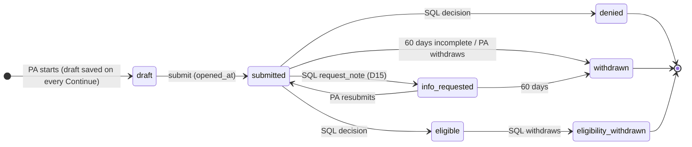
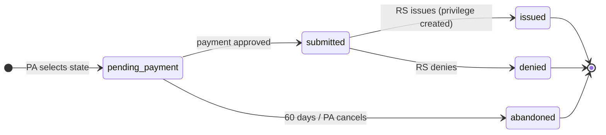
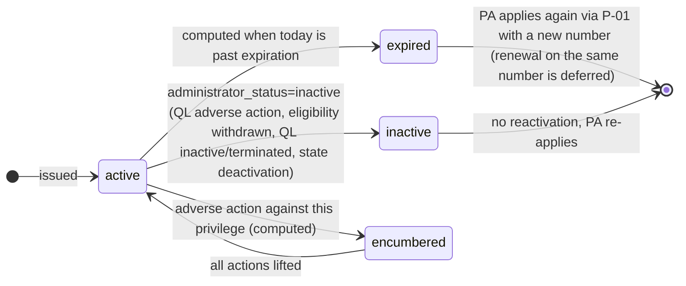

> **Needs review (2026-10-01, SCRUM-39).** This file cites two atoms that quoted draft rule text. That text changed when Rules 3 and 4 were adopted on 2026-04-06. `ATOM-GOV-R23-13` is replaced by `ATOM-GOV-R3-04`; `ATOM-GOV-R23-15` is replaced by `ATOM-GOV-R3-06`. The draft and adopted text are side by side in `product/context/evidence/CHANGES-2026-10-01-adopted-rules.md`.  Remove this note when the file is updated.

# FLOW-06 — State machines

Stored statuses are the ones a person or a rule sets. Privilege *status* is a computed view (decision D1): `active` only if `administrator_status=active`, today ≤ `expiration_date`, and no unlifted adverse action against it. This is CompactConnect's rule too (crosswalk §7 item 5: "status is derived, never edited by hand"); the difference is that we compute it on read where CompactConnect stores and re-derives it.

## Participation application (L-03 / L-05 / L-06)

## Privilege request (P-01 / P-03)

There is no `info_requested` on a privilege request at pilot: a remote state with a question contacts the PA from the case view (D15). Deferred (§5.1): `info_requested` returns with the case message thread; if ACH is enabled (Q-02c), `pending_payment` gains a `submitted_payment_pending` successor and issuance is gated on settlement.

## Privilege (computed status view, never stored)

`deactivation_reason` enum: `qualifying_license_adverse_action | eligibility_withdrawn | qualifying_license_inactive | qualifying_license_terminated | state_deactivated`.

The status vocabulary shown to the PA and the public follows CompactConnect's privilege card and history: "Active (Expires: date)", "Inactive (Expired: date)", "Inactive (Deactivated)", and one event vocabulary for the timeline (issued, renewed, expired, deactivated, disciplinary action, disciplinary action lifted). CompactConnect's "Privilege purchased" becomes "Privilege issued" (crosswalk §3.4).

## Evidence

Atoms are in `product/context/evidence/atoms/`; signals and tensions beside them. Rule section references above resolve to these IDs.

- `ATOM-GOV-R23-13` — `withdrawn` / `abandoned` after 60 days
- `ATOM-GOV-R23-15` — `eligibility_withdrawn` → privileges cancelled
- `ATOM-GOV-ML-09`, `ATOM-GOV-R23-09`, `ATOM-GOV-R23-11` — why privilege status is computed from the QL and never stored
- `SIGNAL-privilege-life-is-tied-to-the-qualifying-license`
